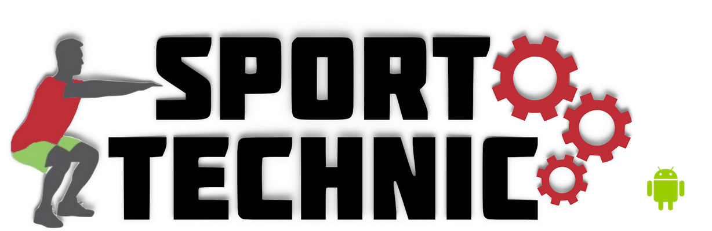
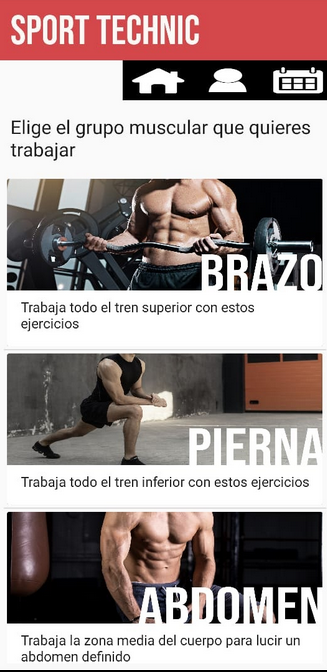
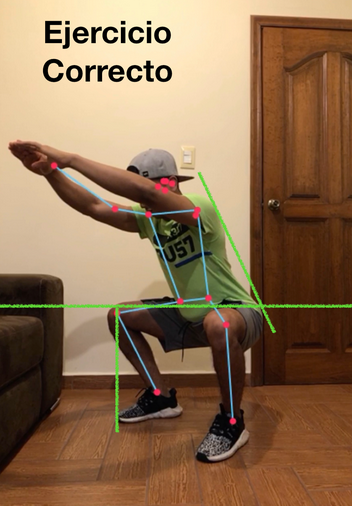
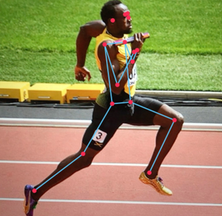

# Sport Technic

## Table of content
* [General Info](#general-information)
* [Technologies Used](#technologies-used)
* [Features](#features)
* [Screenshots](#screenshots)
* [Setup](#setup)
* [Acknowledgements](#acknowledgements)
* [Contact](#contact)

## General Information
Mobile app that assists you while doing your workout by pointing out good and bad movements to help you improving your technique.
Developed for Android mobile phones.

### Developers:
- [Eduardo Gallegos](https://github.com/Eduardogallegos)
- [Pedro Cortes](https://github.com/A01374919)
- [Francisco Javier Zavala](https://github.com/JavierZavala17)
- [Leonardo Castillejos](https://github.com/Eyiry)

## Technologies Used
- [Tensorflow lite](https://www.tensorflow.org/lite/)
- [Android Studio](https://developer.android.com/studio/)
- [Posenet](https://www.tensorflow.org/lite/examples/pose_estimation/overview)

## Features
- The app provides video-tutorials where key aspects of the exercises are explained.
- With an AI model, the app gives you feedback of your movements, angles formed, etc.
- Excercise movements:
    - Abs
        - Plank
        - Sit ups
    - Arms
        - Push ups
        - Dips
    - Cardio
        - Burpees
        - Jump Rope
    - Leg
        - Squats
        - Lunge

## Screenshots

## Setup
1. Clone this repo.
2. Compile the project using Android Studio.
3. Generate APK.
4. Install APK on Android phone.

## Acknowledgements
Thanks to professor [Roberto Martínez Román](https://github.com/rmroman) for being the tutor on this project.

## Contact
Feel free to contact us!
- [Eduardo](mailto:egallegossolis@gmail.com)
- [Pedro](mailto:pedro_corsob@outlook.com)
- [Javier](mailto:javier_z_t@hotmail.com)
- [Leonardo](mailto:l.castillejos@hotmail.com)
